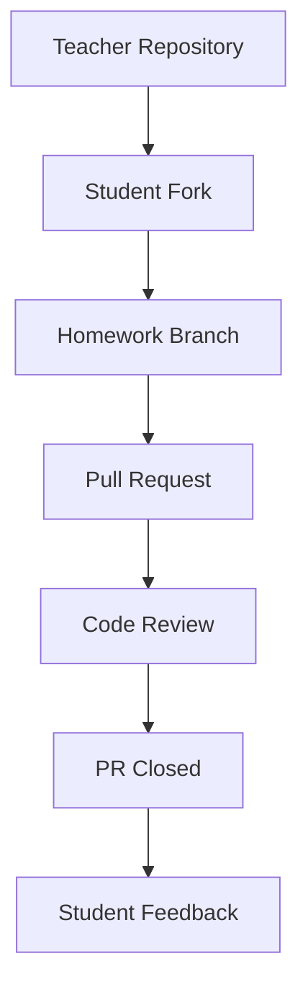
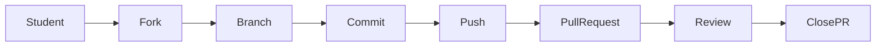

# Архітектура репозиторію

Цей документ описує структуру та робочий процес репозиторію курсу.

Мета репозиторію — організувати матеріали курсу Python, домашні завдання
та взаємодію студентів через GitHub.

---

# Структура репозиторію

Приклад можливої структури:

```

PY-Course-Victor-Nikoriak
│
├── lessons/
│   ├── lesson03_variables
│   ├── lesson04_boolean_logic
│
├── assignments/
│   ├── HW3
│   │   └── README.md
│   │
│   ├── HW4
│   │   └── README.md
│
├── tools/
├── docs/
└── README.md

```

### Пояснення

| Папка | Призначення |
|------|------|
| lessons | матеріали уроків та приклади коду |
| assignments | домашні завдання |
| tools | допоміжні скрипти |
| docs | документація |
| README.md | основна інформація про курс |

---

# Структура домашніх завдань

Кожне домашнє завдання може мати окрему папку.

Приклад:

```

assignments/HW4

```

Всередині знаходиться файл з описом завдання:

```

assignments/HW4/README.md

`````

Приклад змісту:

````markdown
# Homework 4 — Boolean Logic

## Task 1
Напишіть програму, яка повертає перші два та останні два символи рядка.

Приклад:
helloworld → held  
my → mymy  
x → ""

---

## Task 2
Зробіть перевірку номера телефону.

Умови:
- довжина = 10
- тільки цифри

---

## Task 3
Створіть просту вікторину.

Питання:
5 + 3 = ?

---

## Task 4
Перевірте ім'я користувача без урахування регістру.
`````

---

# GitHub workflow

Студенти взаємодіють з репозиторієм через стандартний GitHub workflow.



---

# Робочий процес студента



---

# Навіщо така архітектура

Така структура допомагає:

* організувати матеріали курсу
* відокремити уроки від домашніх завдань
* підтримувати чисту структуру репозиторію
* використовувати реальний GitHub workflow
* навчити студентів працювати з Pull Request

---


